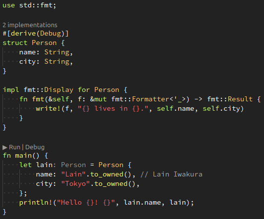

# [Caveman](https://github.com/kafji/caveman)

[Vscode](https://code.visualstudio.com/) theme primarily for highlighting Rust code. Loosely inspired by Monokai & Zenburn.

## Installation

Install it directly from the source code.

1. Clone
2. Install [`vsce`](https://code.visualstudio.com/api/working-with-extensions/publishing-extension#vsce)
3. Run [`./install.sh`](install.sh)
