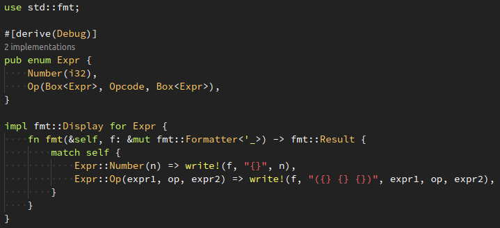

# Caveman

[](https://marketplace.visualstudio.com/items?itemName=kafji.caveman)

[Vscode](https://code.visualstudio.com/) theme loosely inspired by Monokai & Zenburn.



## Features

- Reduced colors.  
  Token colors are based on 6 token types. Reduced from token types available for language extensions.

## Colors

| Color | Type |
|-|-|
| Red, #f66 | Literal |
| White, #fff | Variable & operator |
| Green, #cf6 | Keyword |
| Yellow, #ff6 | Function call & definition |
| Orange, #fc6 | Type |
| Grey, #aaa | Comment |
| Black, #222 | Background |

## Install

Install from [Marketplace](https://marketplace.visualstudio.com/items?itemName=kafji.caveman) or directly from the source code:

1. Clone
2. Install [`vsce`](https://code.visualstudio.com/api/working-with-extensions/publishing-extension#vsce)
3. Run [`./install.sh`](install.sh)

## Development

### Publish

```bash
npm install -g vsce
# Get token from https://code.visualstudio.com/api/working-with-extensions/publishing-extension#get-a-personal-access-token
vsce publish
```
